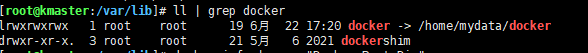

## 容器

### 相关命令

#### 给运行中的容器添加映射端口

- 方法一
  
  - 获得容器IP
    
    ```java
    docker inspect rabbitmq | grep IPAddress
    ```
  
  - iptable转发端口-危险（docker有一次忽然停止了，不知道和这个有关系没）
    
    ```java
    iptables -t nat -A DOCKER -p tcp --dport 8001 -j DNAT --to-destination 172.17.0.19:8000
    ```
  
  - 弊端-方法一无法通过如下命令查看到容器开放的对应端口
    
    ```java
    docker port rabbitmq
    ```

- 方法二
  
  - 提交一个运行中的容器为镜像
    
    ```java
    docker commit -a "<container_name>" -m "<a new image>" web  aaa:v1
    ```
  
  - 运行镜像并添加端口
    
    ```java
    docker run -it --name web_demo -p 8000:80 aaa:v1 /bin/bash
    ```

#### 查看容器开放的端口

```java
docker port rabbitmq
```

#### 修改容器的启动方式

```java
docker container update --restart=always $ContainerName
```

#### 容器中安装vim，wget等

```java
//先更新一波
apt update
//vim
apt install vim
//wget
apt install wget
//yum
apt install yum
//ifconfig
apt install net-tools
//ping
apt install iputils-ping
```

#### 同步宿主机时间到容器

```shell
docker cp /etc/localtime $ContainerName:/etc/
```

#### 指定容器时区

```shell
docker run -p 80:80 --name nginx \
-e TZ="Asia/Shanghai" \
-d nginx:1.17.0
```

#### 查看容器资源占用状况

- 查看指定容器资源占用状况，比如cpu、内存、网络、io状态：
  
  ```shell
  docker stats $ContainerName
  ```

- 查看所有容器资源占用情况：
  
  ```shell
  docker stats -a
  ```

#### 查看容器磁盘使用情况

```shell
docker system df
```

#### 修改镜像的存放位置

- 查看Docker镜像的存放位置：
  
  ```shell
  docker info | grep "Docker Root Dir"
  ```

- 关闭Docker服务：
  
  ```shell
  systemctl stop docker
  ```

- 查看适合的目标目录
  
  ```shell
  df -h
  ```

- 先将原镜像目录移动到目标目录,这里千万要确认是否移动成功：
  
  ```shell
  mv /var/lib/docker/* /home/mydata/docker/
  cd /var/lib
  rm -rf docker
  ```

- 建立软连接：
  
  ```shell
  ln -s /home/mydata/docker /var/lib/docker
  ```
  
  

#### 按名称通配符删除容器，比如删除以名称mall-开头的容器

```shell
docker rm `docker ps -a | grep mall-* | awk '{print $1}'`
```

#### 强制删除所有容器；

```shell
docker rm -f $(docker ps -a -q)
```

#### 容器内查看端口是否放开

```java
telnet ip port
```

若telnet未安装，则如下命令安装

```java
apt-get update
apt-get install telnet -y
```
