## Pod

### Pod概述

> Pod 是 k8s 系统中可以创建和管理的最小单元，是资源对象模型中由用户创建或部署的最 小资源对象模型，也是在 k8s 上运行容器化应用的资源对象，其他的资源对象都是用来支 撑或者扩展 Pod 对象功能的，比如控制器对象是用来管控 Pod 对象的，Service 或者 Ingress 资源对象是用来暴露 Pod 引用对象的，PersistentVolume 资源对象是用来为 Pod 提供存储等等，k8s 不会直接处理容器，而是 Pod，Pod 是由一个或多个 container 组成 Pod 是 Kubernetes 的最重要概念，每一个 Pod 都有一个特殊的被称为”根容器“的 Pause 容器。Pause 容器对应的镜 像属于 Kubernetes 平台的一部分，除了 Pause 容器，每个 Pod 还包含一个或多个紧密相关的用户业务容器

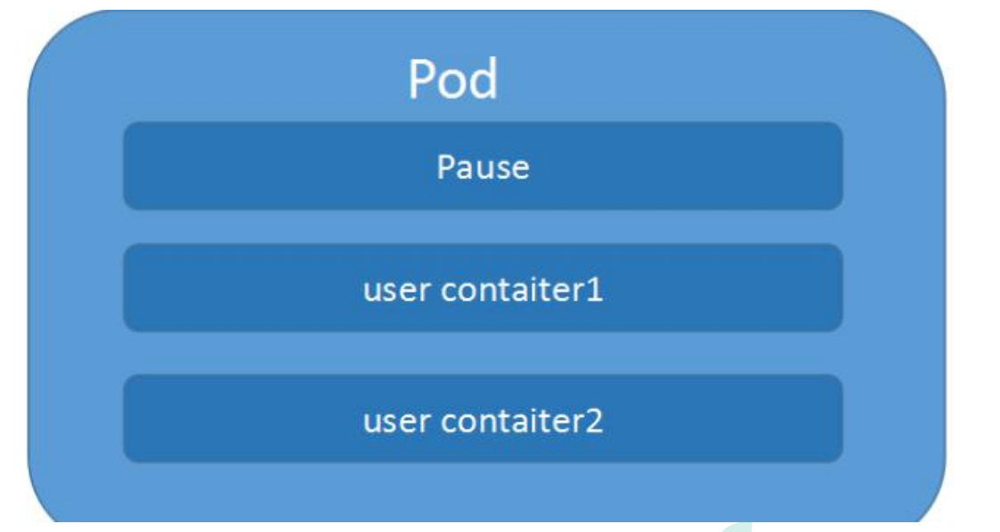

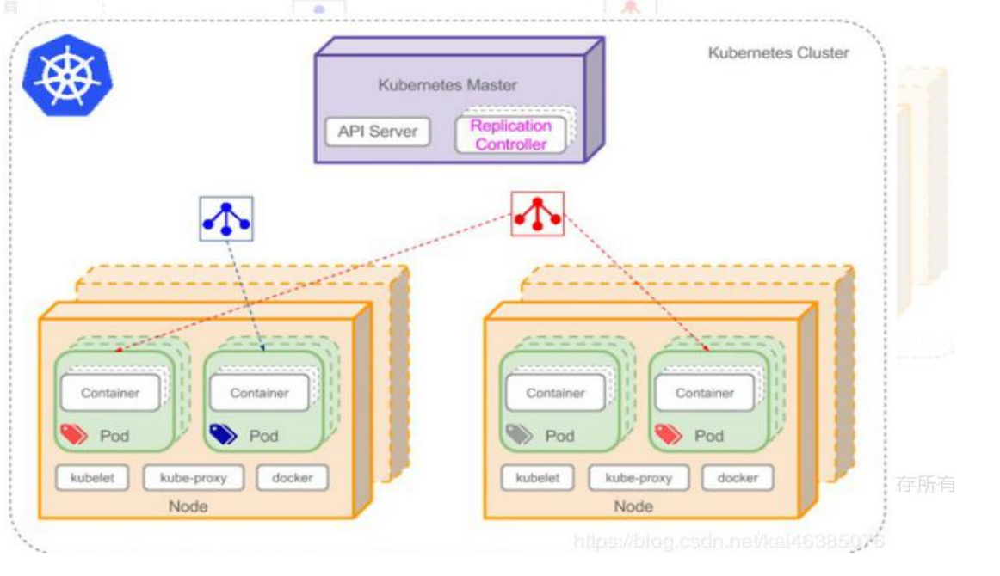

- Pod vs 应用

  每个 Pod 都是应用的一个实例，有专用的 IP

- Pod vs 容器

  一个 Pod 可以有多个容器，彼此间共享网络和存储资源，每个 Pod 中有一个 Pause 容器保 存所有的容器状态， 通过管理 pause 容器，达到管理 pod 中所有容器的效果

- Pod vs 节点

  同一个 Pod 中的容器总会被调度到相同 Node 节点，不同节点间 Pod 的通信基于虚拟二层网 络技术实现

- Pod vs Pod

  普通的 Pod 和静态 Pod

### Pod基本概念

- 最小部署单元
- 包含多个容器（一组容器的集合）
- 一个pod中容器共享网络命名空间
- pod是短暂的（重启后ip发生变化）

### Pod存在的意义

- 创建容器使用docker，一个容器运行一个应用程序
- Pod是多进程设计，运行多个应用程序，一个pod里有多个容器，一个容器运行一个运行程序
- Pod存在为了亲密性应用（两个应用之间进行交互、网络之间调用使用localhost就可以，两个应用需要频繁调用。

### Pod实现机制

- 共享网络

  容器本身之间是相互隔离的（namespace/group)。通过pause容器，将其他业务容器加入到pause容器里面，让所有业务容器在同一个命名空间中，这样就可以实现网络共享。

- 共享存储

  引入数据券概念Volumn，使用数据卷进行持久化存储。

- 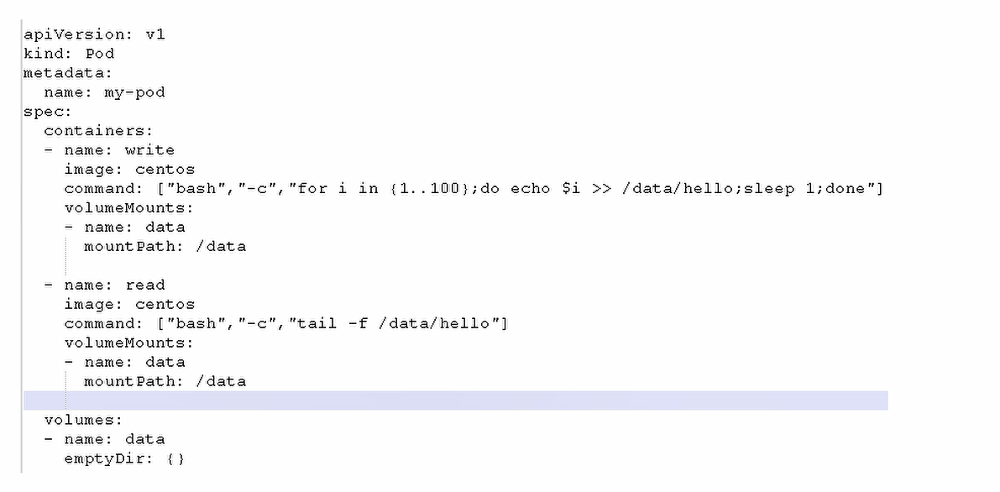

  

### Pod 特性

- 资源共享

  一个 Pod 里的多个容器可以共享存储和网络，可以看作一个逻辑的主机。共享的如 namespace,cgroups 或者其他的隔离资源。

  多个容器共享同一 network namespace，由此在一个 Pod 里的多个容器共享 Pod 的 IP 和 端口 namespace，所以一个 Pod 内的多个容器之间可以通过 localhost 来进行通信,所需要 注意的是不同容器要注意不要有端口冲突即可。不同的 Pod 有不同的 IP,不同 Pod 内的多 个容器之间通信，不可以使用 IPC（如果没有特殊指定的话）通信，通常情况下使用 Pod 的 IP 进行通信。

  一个 Pod 里的多个容器可以共享存储卷，这个存储卷会被定义为 Pod 的一部分，并且可 以挂载到该 Pod 里的所有容器的文件系统上。

- 生命周期短暂

  Pod 属于生命周期比较短暂的组件，比如，当 Pod 所在节点发生故障，那么该节点上的 Pod 会被调度到其他节点，但需要注意的是，被重新调度的 Pod 是一个全新的 Pod,跟之前的 Pod 没有半毛钱关系。

- 平坦的网络

  K8s 集群中的所有 Pod 都在同一个共享网络地址空间中，也就是说每个 Pod 都可以通过其 他 Pod 的 IP 地址来实

### 镜像拉取策略

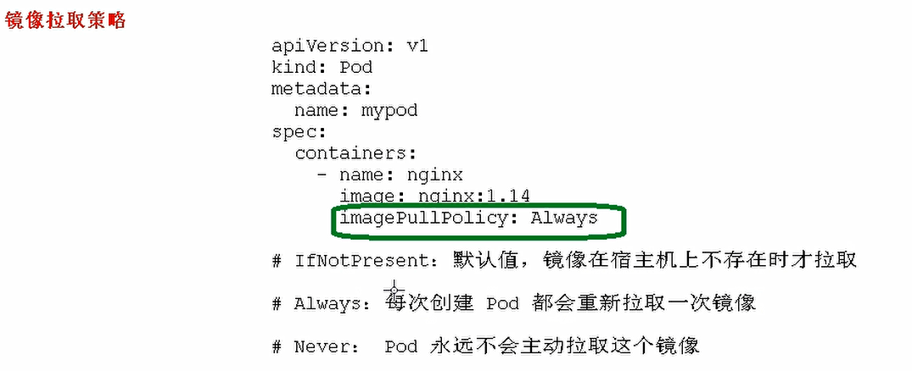

### Pod资源限制

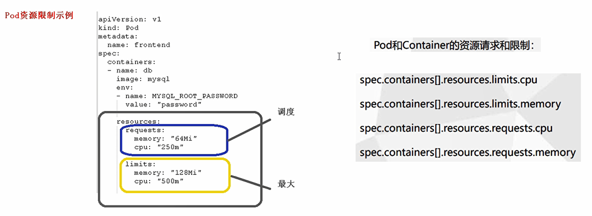

### Pod重启机制

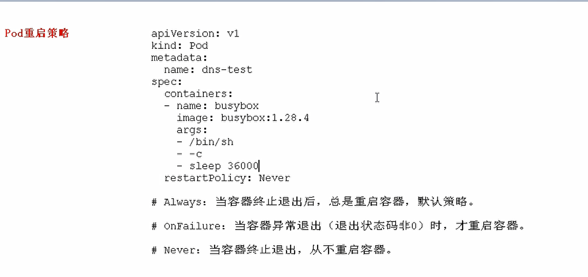

### Pod健康检查


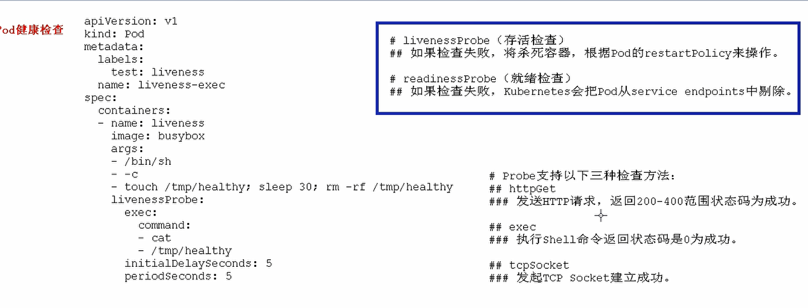

### Pod调度策略

```shell
[root@kmaster:~]# kubectl get pods
NAME                    READY   STATUS    RESTARTS   AGE
nginx-f89759699-lnm8h   1/1     Running   0          2d1h
[root@kmaster:~]# kubectl get pods -o wide
NAME                    READY   STATUS    RESTARTS   AGE    IP           NODE     NOMINATED NODE   READINESS GATES
nginx-f89759699-lnm8h   1/1     Running   0          2d2h   10.244.2.2   knode2   <none>           <none>

```

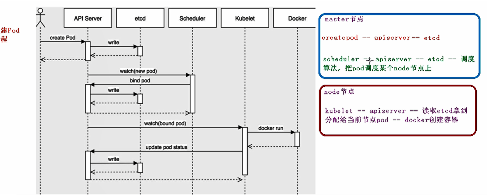

### Pod调度

#### 影响调度的属性

- 资源限制，根据request找到足够node节点进行调度
- 节点选择器标签影响pod调度

1. 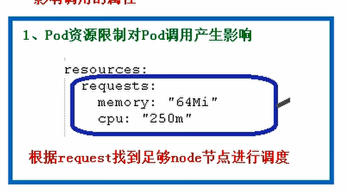
2. 

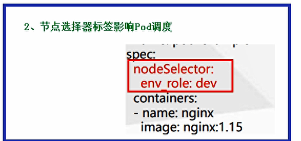

3. 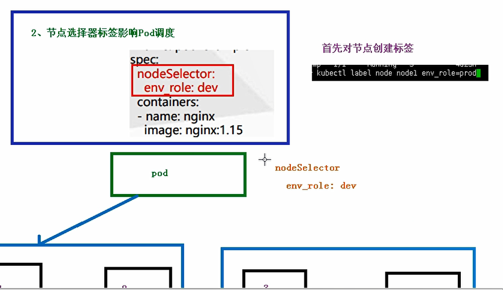

   ```shell
   [root@kmaster:~]# kubectl get nodes
   NAME      STATUS   ROLES    AGE    VERSION
   kmaster   Ready    master   2d3h   v1.18.0
   knode1    Ready    <none>   2d2h   v1.18.0
   knode2    Ready    <none>   2d2h   v1.18.0
   [root@kmaster:~]# kubectl label node knode2 env_role=prod
   node/knode2 labeled
   [root@kmaster:~]# kubectl get nodes knode2 --show-labels
   NAME     STATUS   ROLES    AGE    VERSION   LABELS
   knode2   Ready    <none>   2d3h   v1.18.0   beta.kubernetes.io/arch=amd64,beta.kubernetes.io/os=linux,env_role=prod,kubernetes.io/arch=amd64,kubernetes.io/hostname=knode2,kubernetes.io/os=linux
   
   ```

   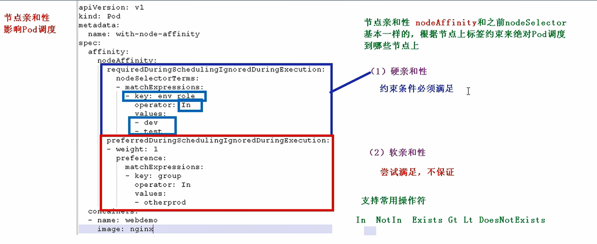
   
4. 影响pod调度：污点和污点容忍

   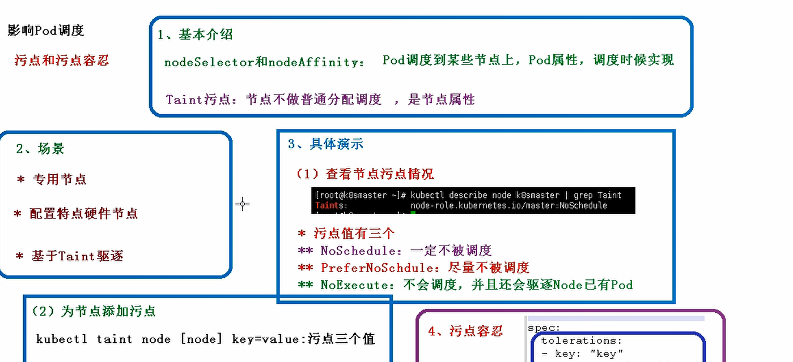

   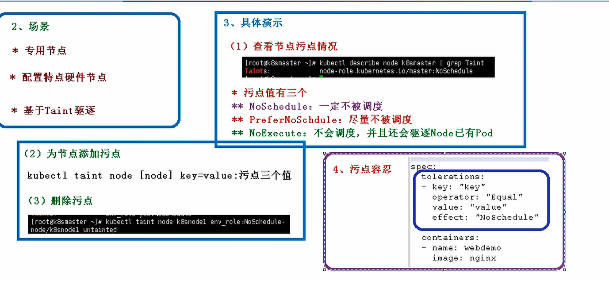


### Pod定义

- 下面是 yaml 文件定义的 Pod 的完整内容

  ```shell
  apiVersion: v1
  kind: Pod
    metadata: //元数据
  name: string
  namespace: string
  labels:
    -name: string
  annotations:
    -name: string
  spec:
  ```


### Pod 的基本使用方

> 在 kubernetes 中对运行容器的要求为：容器的主程序需要一直在前台运行，而不是后台运 行。应用需要改造成前 台运行的方式。如果我们创建的 Docker 镜像的启动命令是后台执 行程序，则在 kubelet 创建包含这个容器的 pod 之 后运行完该命令，即认为 Pod 已经结束， 将立刻销毁该 Pod。如果为该 Pod 定义了 RC，则创建、销毁会陷入一个无 限循环的过程中。 Pod 可以由 1 个或多个容器组合而成

- 一个容器组成的 Pod 的 yaml 示例

  ```yaml
  # 一个容器组成的 Pod
  apiVersion: v1 kind: Pod metadata:
  name: mytomcat labels:
  name: mytomcat spec:
  containers:
  - name: mytomcat image: tomcat ports:
  - containerPort: 8000
  ```

- 多个容器组成的 Pod 的 yaml 示例

  ```yaml
  #两个紧密耦合的容器
  apiVersion: v1 kind: Pod metadata:
  name: myweb labels:
  name: tomcat-redis
  spec:
  containers:
  -name: tomcat image: tomcat ports:
  -containerPort: 8080
  -name: redis image: redis ports:
  -containerPort: 6379
  ```

- 创建

  ```shell
  kubectl create -f xxx.yaml
  ```

- 查看

  ```shell
  kubectl get pod/po <Pod_name>
  kubectl get pod/po <Pod_name> -o wide
  kubectl describe pod/po <Pod_name>
  ```

- 删除

  ```shell
  kubectl delete -f pod pod_name.yaml
  kubectl delete pod --all/[pod_name]
  ```

### Pod的分类

> Pod 有两种类型

- 普通 Pod

  普通 Pod 一旦被创建，就会被放入到 etcd 中存储，随后会被 Kubernetes Master 调度到某 个具体的 Node 上并进行绑定，随后该 Pod 对应的 Node 上的 kubelet 进程实例化成一组相 关的 Docker 容器并启动起来。在默认情 况下，当 Pod 里某个容器停止时，Kubernetes 会 自动检测到这个问题并且重新启动这个 Pod 里某所有容器， 如果 Pod 所在的 Node 宕机， 则会将这个 Node 上的所有 Pod 重新调度到其它节点

- 静态 Pod

  静态 Pod 是由 kubelet 进行管理的仅存在于特定 Node 上的 Pod,它们不能通过 API Server 进行管理，无法与 ReplicationController、Deployment 或 DaemonSet 进行关联，并且 kubelet 也无法对它们进行健康检查。

### Pod 生命周期和重启策略

- Pod的状态

  | 状态值    | 说明                                                         |
  | --------- | ------------------------------------------------------------ |
  | Pending   | API Server已经创建了该Pod，但Pod中的一个或多个容器的镜像还没有创建，包括镜像下载过程 |
  | Running   | Pod内所有容器已创建，且至少一个容器处于运行状态、正在启动状态或正在重启状态 |
  | Completed | Pod内所有容器均成功执行退出，且不会再重启                    |
  | Failed    | Pod内所有容器均已退出，单至少一个容器退出失败                |
  | Unknown   | 由于某种原因无法获取Pod状态，例如网络通信不畅                |

- Pod重启策略

  > Pod 的重启策略包括 Always、OnFailure 和 Never，默认值为Alaways

  | 重启策略  | 说明                                                   |
  | --------- | ------------------------------------------------------ |
  | Always    | 当容器失效时，又kubelet自动重启该容器                  |
  | OnFailure | 当容器终止运行且退出码不为0时，由kubelet自动重启该容器 |
  | Never     | 无论容器运行状态如何，kubelet都不会重启该容器          |

- 常见状态转换

  | Pod包含容器数 | Pod当前的状态 | 发生事件        | Pod的结果状态        | 的                      |                     |
  | ------------- | ------------- | --------------- | -------------------- | ----------------------- | ------------------- |
  | Pod重启策略   |               |                 | RestartPolicy=Always | RestartPolicy=OnFailure | RestartPolicy=Never |
  | 1             | Running       | 容器成功退出    | Running              | Successed               | Successed           |
  | 1             | Running       | 容器失败退出    | Running              | Running                 | Failure             |
  | 2             | Running       | 1个容器失败退出 | Running              | Running                 | Running             |
  | 2             | Running       | 容器被OOM杀掉   | Running              | Running                 | Failure             |

### Pod 资源配置

> 每个 Pod 都可以对其能使用的服务器上的计算资源设置限额，Kubernetes 中可以设置限额 的计算资源有 CPU 与 Memory 两种，其中 CPU 的资源单位为 CPU 数量,是一个绝对值而非相 对值。Memory 配额也是一个绝对值，它的单 位是内存字节数。 Kubernetes 里，一个计算资源进行配额限定需要设定以下两个参数： Requests 该资源最 小申请数量，系统必须满足要求 Limits 该资源最大允许使用的量，不能突破，当容器试 图使用超过这个量的资源时，可能会被 Kubernetes Kill 并重启

- 举例

  ```yaml
  sepc
  containers:
  - name: db
  image: mysql
  resources:
  requests:
  memory: "64Mi"
  cpu: "250m"
  limits:
  memory: "128Mi"
  cpu: "500m"
  ```

  上述代码表明 MySQL 容器申请最少 0.25 个 CPU 以及 64MiB 内存，在运行过程中容器所能使 用的资源配额为 0.5 个 CPU 


