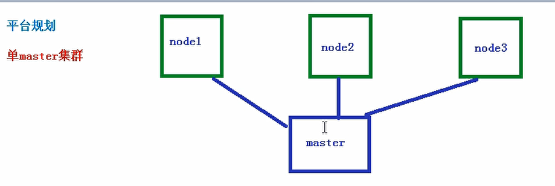
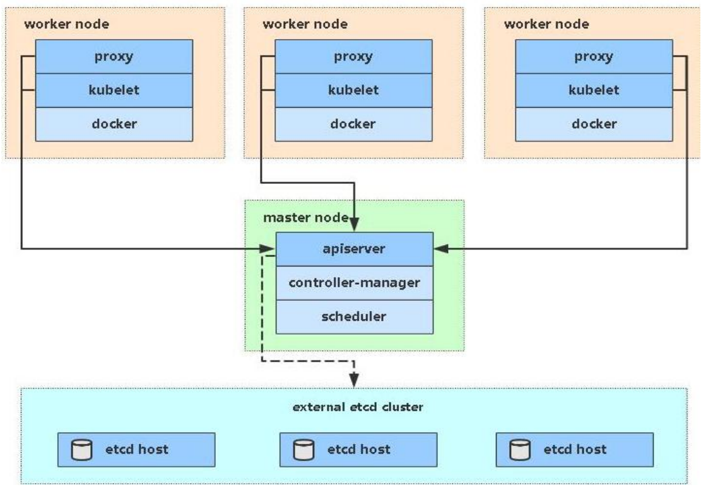

## 单master集群

### 平台规划图



### 安装要求

- 一台或多台机器，操作系统 CentOS7.x-86_x64
- 硬件配置：2GB 或更多 RAM，2 个 CPU 或更多 CPU，硬盘 30GB 或更多 
- 集群中所有机器之间网络互通
- 可以访问外网，需要拉取镜像 
- 禁止 swap 分区

### 最终目标

1. 在所有节点上安装 Docker 和 kubeadm 
2. 部署 Kubernetes Master
3. 部署容器网络插件
4. 部署 Kubernetes Node，将节点加入 Kubernetes 集群中 
5. 部署 Dashboard Web 页面，可视化查看 Kubernetes 资源

### 准备环境



| 角色       | IP          |
| ---------- | ----------- |
| k8s-master | 10.10.30.42 |
| k8s-node1  | 10.10.30.44 |
| k8s-node2  | 10.10.30.94 |

### 系统初始化

- 关闭防火墙

  ```shell
  systemctl stop firewalld
  systemctl 
  ```

- 关闭selinux

  ```shell
  sed -i 's/enforcing/disabled/' /etc/selinux/config # 永久
  setenforce 0 # 临时
  ```

- 关闭swap

  ```shell
  swapoff -a # 临时
  vim /etc/fstab # 永
  ```

  

- 主机名

  ```shell
  hostnamectl set-hostname <hostname>
  ```

- master添加host

  ```shell
  cat >> /etc/hosts << EOF
  10.10.30.42 k8s-master
  10.10.30.44 k8s-node1
  10.10.30.94 k8s-node2
  EOF
  ```

  

- 将桥接IPv4流量传递到iptables的链

  ```shell
  cat > /etc/sysctl.d/k8s.conf << EOF
  net.bridge.bridge-nf-call-ip6tables = 1
  net.bridge.bridge-nf-call-iptables = 1
  EOF
  sysctl --system # 生效
  ```

  

- 时间同步

  ```shell
  yum install ntpdate -y
  ntpdate time.windows.com
  ```

  