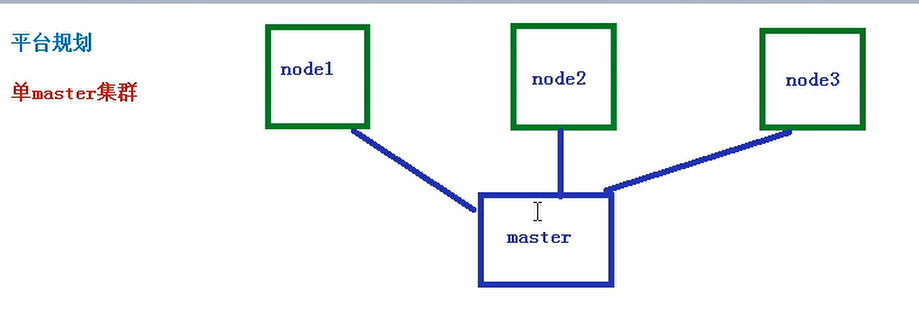

## k8s环境搭建

### 平台规划

#### 单master集群

- 

#### 多master集群

### 硬件要求

#### master

- 2核
- 4G
- 20G

#### node

- 4核
- 8G
- 40G

### 搭建集群方式

### kubeadm

> Kubeadm 是一个 K8s 部署工具，提供 kubeadm init 和 kubeadm join，用于快速部 署 Kubernetes 集群。
>
> kubeadm 是官方社区推出的一个用于快速部署 kubernetes 集群的工具，这个工具能通 过两条指令完成一个 kubernetes 集群的部署： 第一、创建一个 Master 节点 kubeadm init 第二， 将 Node 节点加入到当前集群中 $ kubeadm join Master 节点的 IP 和端口

#### 二进制包

> 从 github 下载发行版的二进制包，手动部署每个组件，组成 Kubernetes 集群。 Kubeadm 降低部署门槛，但屏蔽了很多细节，遇到问题很难排查。如果想更容易可 控，推荐使用二进制包部署 Kubernetes 集群，虽然手动部署麻烦点，期间可以学习很 多工作原理，也利于后期维护。

#### 节点规划

- 10.10.30.42 master
- 10.10.30.44 node1
- 10.10.30.94 node2

